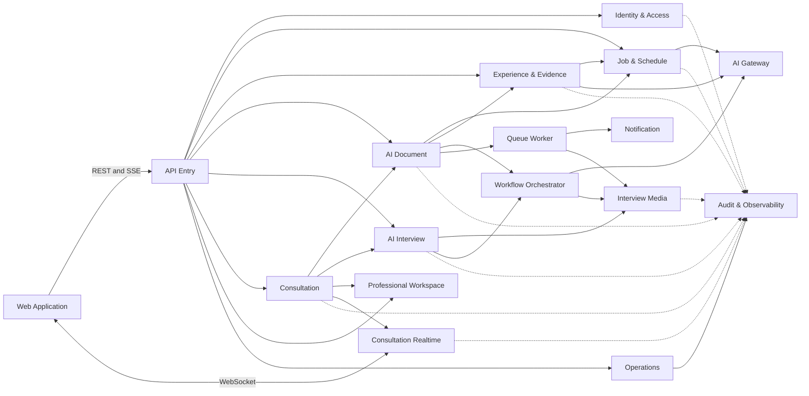
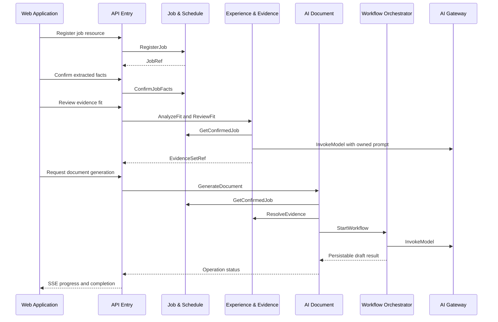
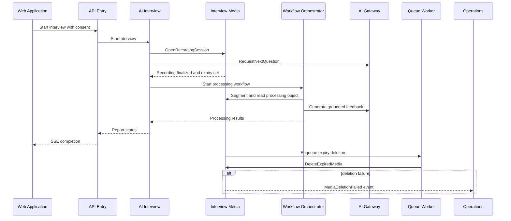
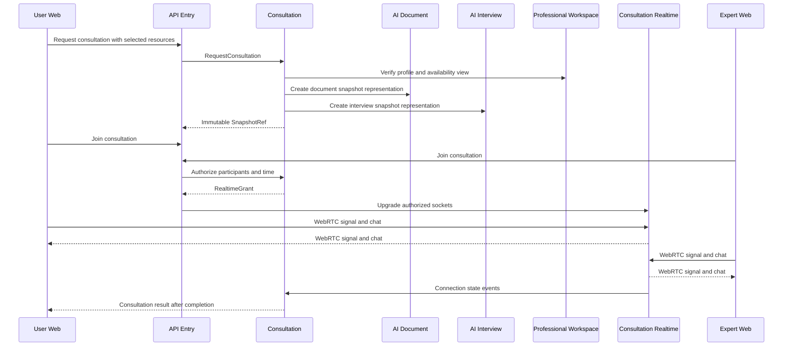
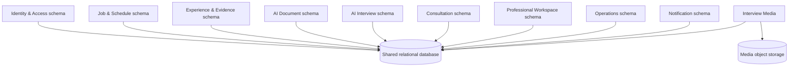

# 컴포넌트 의존성과 데이터 흐름

## 1. 의존성 원칙
1. `Web Application`은 `API Entry`만 업무 진입점으로 사용한다. 상담 실시간 연결도 `API Entry`의 권한 검증 후 `Consultation Realtime`로 승격한다.
2. `API Entry`는 업무 컴포넌트를 호출할 수 있지만 업무 데이터나 규칙을 소유하지 않는다.
3. 핵심 업무 컴포넌트는 자신의 스키마·테이블만 읽고 쓴다. 공유 관계형 DB는 물리적 공유일 뿐 논리적 소유권을 약화하지 않는다.
4. `AI Gateway`는 업무 컴포넌트를 호출하지 않는다. 업무 컴포넌트가 프롬프트·근거 문맥을 구성해 `AI Gateway` Port를 호출한다.
5. `Workflow Orchestrator`와 `Queue Worker`는 업무 규칙의 소유자가 아니며, 등록된 Command·Port를 호출하고 실행 상태를 보고한다.
6. `Interview Media`와 `Consultation Realtime`은 서로 의존하지 않는다. AI 면접 미디어와 전문가 상담 WebRTC를 합치지 않는다.
7. 동기 호출 사슬은 짧게 유지하고 장시간·재시도 가능 작업은 비동기로 전환한다.
8. 컴포넌트 간 데이터 복제는 소유자가 발행한 이벤트 계약으로만 수행하며, 소비자는 멱등 처리한다.
9. 순환 컴파일·런타임 의존성을 금지한다. 양방향 업무 협력이 필요하면 상위 애플리케이션 서비스, Port 또는 이벤트로 분리한다.
10. `Audit & Observability`는 관측 이벤트를 수신하지만 업무 성공 경로의 필수 동기 의존성이 되지 않는다.

## 2. 허용 및 금지 방향
### 2.1 허용
- 채널 → 진입 경계 → 업무 컴포넌트
- 업무 컴포넌트 → 소유권이 명시된 다른 컴포넌트 Query·Port
- 업무 컴포넌트 → AI Gateway
- 업무 컴포넌트 → Workflow Orchestrator 또는 Queue Worker에 작업 등록
- Workflow Orchestrator 또는 Queue Worker → 등록된 업무 Command·Port
- 전체 컴포넌트 → 비차단 관측·감사 계약
- 이벤트 소비자 → 자기 저장소 갱신 또는 자기 Command 실행

### 2.2 금지
- 다른 업무 컴포넌트의 테이블 직접 조회·수정
- Web Application의 업무 저장소 또는 AI 공급자 직접 접근
- API Entry에 도메인 상태 전이·프롬프트·보상 로직 배치
- AI Gateway에 업무 프롬프트, 근거 판정, 사용자 결과 품질 책임 이전
- Workflow Orchestrator 또는 Queue Worker에 업무 데이터 원장 소유
- Consultation Realtime가 상담 스냅샷 권한을 독자 판정
- Interview Media와 Consultation Realtime의 저장·세션 모델 공유
- Audit & Observability 장애가 핵심 쓰기 트랜잭션을 무기한 차단
- 동기 A→B와 동기 B→A를 동시에 두는 순환 의존

## 3. 의존성 매트릭스 읽기
행은 호출자 또는 이벤트 발행자, 열은 대상이다. `S`는 동기 Port/Command, `E`는 이벤트, `W`는 워크플로 단계, `Q`는 큐 작업, `R`은 실시간 채널, `O`는 관측·감사 전송, `-`는 직접 의존 없음이다.

| From \ To | API | IAM | JOB | EXP | DOC | INT | CNS | PRF | OPS | AIG | WFO | QWK | IMD | CRT | NOT | AOB |
|---|---:|---:|---:|---:|---:|---:|---:|---:|---:|---:|---:|---:|---:|---:|---:|---:|
| Web Application | S/R | - | - | - | - | - | - | - | - | - | - | - | - | - | - | O |
| API Entry | - | S | S | S | S | S | S | S | S | - | - | - | - | R | - | O |
| Identity & Access | - | - | - | - | - | - | - | - | E | - | - | Q | - | - | E | O |
| Job & Schedule | - | S | - | - | - | - | - | - | E | S | - | Q | - | - | E | O |
| Experience & Evidence | - | S | S | - | - | - | - | - | E | S | - | - | - | - | - | O |
| AI Document | - | S | S | S | - | - | - | - | E | S | W | Q | - | - | E | O |
| AI Interview | - | S | S | - | S | - | - | - | E | S | W | Q | S | - | E | O |
| Consultation | - | S | S | - | S | S | - | S | E | - | - | Q | - | S | E | O |
| Professional Workspace | - | S | - | - | - | - | S | - | E | - | - | - | - | - | - | O |
| Operations | - | S | - | - | - | S | S | S | - | - | - | Q | S | S | E | O |
| AI Gateway | - | - | - | - | - | - | - | - | E | - | - | - | - | - | - | O |
| Workflow Orchestrator | - | - | - | - | W | W | - | - | E | S | - | - | W | - | - | O |
| Queue Worker | - | - | - | - | Q | - | - | - | E | - | - | - | Q | - | Q | O |
| Interview Media | - | S | - | - | - | E | - | - | E | - | W | Q | - | - | E | O |
| Consultation Realtime | - | S | - | - | - | - | S | - | E | - | - | - | - | - | - | O |
| Notification | - | S | - | - | - | - | - | - | E | - | - | Q | - | - | - | O |
| Audit & Observability | - | - | - | - | - | - | - | - | E | - | - | - | - | - | - | - |

약어: API=`API Entry`, IAM=`Identity & Access`, JOB=`Job & Schedule`, EXP=`Experience & Evidence`, DOC=`AI Document`, INT=`AI Interview`, CNS=`Consultation`, PRF=`Professional Workspace`, OPS=`Operations`, AIG=`AI Gateway`, WFO=`Workflow Orchestrator`, QWK=`Queue Worker`, IMD=`Interview Media`, CRT=`Consultation Realtime`, NOT=`Notification`, AOB=`Audit & Observability`.

## 4. 통신 패턴과 계약
| 패턴 | 사용 위치 | 계약 소유자 | 복원력·일관성 규칙 |
|---|---|---|---|
| REST Command/Query | Web Application → API Entry → 업무 컴포넌트 | 대상 업무 컴포넌트 | 시간 제한, 입력 한도, 소유권, Command 멱등 키 |
| SSE | API Entry → Web Application | 작업 원장 소유 업무 컴포넌트 | 단방향, 순서/재개 위치, 연결 끊김 후 재구독 |
| WebSocket | Web Application ↔ Consultation Realtime | Consultation Realtime의 전송 계약, Consultation의 권한 계약 | 양방향, 재연결, 참가자·기간 fail closed |
| 동기 내부 Port | 업무 컴포넌트 간 최소 조회 | 제공 컴포넌트 | 짧은 호출 사슬, 명시적 시간 예산, 다른 테이블 접근 금지 |
| 도메인 이벤트 | 컴포넌트 간 상태 통지 | 이벤트를 발행하는 데이터 소유 컴포넌트 | at-least-once, EventId, 버전, 멱등 소비 |
| 워크플로 단계 | Workflow Orchestrator ↔ AI Document/AI Interview/Interview Media/AI Gateway | 업무 흐름 정의는 업무 컴포넌트, 실행 상태는 Workflow Orchestrator | 체크포인트, 제한 재시도, 보상 Command |
| 큐 작업 | Queue Worker ↔ Notification/AI Document/Interview Media | 업무 작업 계약은 요청 컴포넌트, 전달 계약은 Queue Worker | TaskRef, 멱등 키, 제한 재시도, 격리 |
| 관측·감사 | 전체 → Audit & Observability | 신호 생산 컴포넌트와 공통 스키마 관리 책임 | 비차단 전송, 민감 본문 금지, 상관관계 ID |

## 5. 이벤트 계약 소유권
| 이벤트 | 계약 소유자 | 대표 소비자 | 의미와 멱등 기준 |
|---|---|---|---|
| `AccountDeletionRequested` | Identity & Access | 모든 사용자 데이터 소유 컴포넌트, Operations | 계정 삭제 전파 시작; AccountRef + DeletionGeneration |
| `JobConfirmed` | Job & Schedule | Experience & Evidence, AI Document | 확정 공고 버전 사용 가능; JobRef + VersionRef |
| `ScheduleDue` | Job & Schedule | Notification | 알림 대상 일정 도래; ScheduleRef + TriggerTime |
| `EvidenceReviewCompleted` | Experience & Evidence | AI Document | 사용자 승인 근거 범위 확정; EvidenceSetRef + VersionRef |
| `DocumentGenerationCompleted` | AI Document | Notification, Consultation | 검토 가능한 초안 생성; OperationRef |
| `DocumentFinalized` | AI Document | Consultation | 고정 가능한 문서 버전 생성; DocumentRef + VersionRef |
| `InterviewProcessingRequested` | AI Interview | Workflow Orchestrator | 면접 후처리 시작; InterviewRef + OperationRef |
| `InterviewReportCompleted` | AI Interview | Notification, Consultation | 상담 Snapshot 후보 리포트 생성; ReportRef + VersionRef |
| `MediaExpired` | Interview Media | Queue Worker | 7일 만료 삭제 실행 가능; MediaRef + ObjectGeneration |
| `MediaDeletionFailed` | Interview Media | Operations, Notification, Audit & Observability | 보존 위반 위험; MediaRef + AttemptGeneration |
| `ConsultationRequested` | Consultation | Professional Workspace, Notification | 지정 전문가 상담 요청; ConsultationRef |
| `ConsultationCompleted` | Consultation | Professional Workspace, Notification | 권한 종료와 결과 제공; ConsultationRef + CompletionGeneration |
| `ProfessionalVerified` | Operations | Professional Workspace, Consultation | 전문가 활성 상태 변경; ProfessionalRef + ReviewVersion |
| `NotificationDeliveryFailed` | Notification | Operations, Audit & Observability | 이메일 전달 격리; DeliveryRef + AttemptGeneration |

계약 소유자는 하위 호환 가능한 버전 정책을 제공해야 한다. 필드와 직렬화 형식은 Functional/NFR Design에서 확정하고, PBT-02 왕복 속성 검증 대상으로 전달한다.

## 6. 전체 구조

### 텍스트 대안
1. `Web Application`은 REST/SSE를 위해 `API Entry`를 사용하고 상담 실시간 연결만 권한 승인 후 `Consultation Realtime`과 WebSocket으로 연결한다.
2. `API Entry`는 여덟 업무 컴포넌트에 라우팅하며 `Identity & Access`의 인증 문맥을 사용한다.
3. `Job & Schedule`, `Experience & Evidence`, `AI Document`, `AI Interview`가 업무 프롬프트와 근거를 소유한 채 `AI Gateway`를 사용한다.
4. `AI Document`와 `AI Interview`는 다단계 흐름을 `Workflow Orchestrator`에 맡기고, PDF·이메일·삭제는 `Queue Worker`가 처리한다.
5. `Interview Media`와 `Consultation Realtime`은 서로 분리되어 각각 면접 객체 수명주기와 상담 WebRTC/채팅을 담당한다.
6. 모든 컴포넌트는 비차단 방식으로 `Audit & Observability`에 감사·관측 신호를 보낸다.

## 7. 공고에서 문서까지 데이터 흐름

### 텍스트 대안
- 사용자가 공고를 등록·확정하면 `Job & Schedule`이 확정 버전을 소유한다.
- `Experience & Evidence`는 확정 공고와 사용자 경험을 사용해 적합도를 분석하고 사용자 결정을 저장한다.
- `AI Document`는 공고·근거 참조를 검증한 뒤 `Workflow Orchestrator`를 시작한다.
- `AI Gateway` 호출은 각 업무 컴포넌트가 소유한 프롬프트와 근거 범위로 수행된다.
- 진행과 완료는 `AI Document` 작업 원장을 거쳐 SSE로 전달된다.

## 8. AI 면접과 미디어 흐름

### 텍스트 대안
- `AI Interview`가 동의와 면접 맥락을, `Interview Media`가 녹화 객체와 7일 만료를 소유한다.
- 종료 후 `Workflow Orchestrator`가 구간화·전사·관찰·피드백·리포트 단계를 조정한다.
- `AI Gateway`는 공급자 호출만 담당하고 질문·피드백 근거와 금지 규칙은 `AI Interview`가 소유한다.
- 만료 삭제는 `Queue Worker`가 실행하며 실패하면 `Operations`와 관측 경계에 이벤트가 전달된다.

## 9. 상담 실시간 흐름

### 텍스트 대안
- 사용자가 선택한 문서·면접 버전만 `Consultation`의 불변 스냅샷에 들어간다.
- `Professional Workspace`는 전문가 프로필·가용 시간을 제공하지만 스냅샷 권한을 결정하지 않는다.
- 두 참가자는 `Consultation`이 발급한 시간 제한 `RealtimeGrant`가 있어야 `Consultation Realtime`에 연결된다.
- WebRTC 신호와 채팅은 WebSocket으로 흐르고, 상담 자료 조회는 계속 `Consultation` 권한 계약을 따른다.

## 10. 데이터 저장 경계

### 텍스트 대안
- 하나의 관계형 데이터베이스 안에 업무 컴포넌트별 스키마·테이블 소유권을 둔다.
- 물리적으로 같은 DB를 사용해도 다른 컴포넌트는 소유 테이블에 직접 접근하지 않는다.
- `Interview Media`는 객체 저장소의 원본·분할 미디어와 관계형 저장소의 메타데이터·만료·삭제 상태를 소유한다.
- 전사문·리포트는 미디어 객체와 분리해 `AI Interview`가 소유한다.

## 11. 복원력 의존성 계약
| 의존성 | 장애 격리 | 단계적 저하 | 후속 용량·쿼터 게이트 |
|---|---|---|---|
| AI 공급자 | AI Gateway 시간 제한·회로 차단·호출 격리 | 수동 입력·편집·기존 결과 조회 | 요청률·토큰·동시성·비용 한도 |
| 이메일 전달 | Queue Worker 제한 재시도·격리 | 서비스 내 알림 유지 | 발송률·반송률·큐 적체 |
| 객체 저장 | Interview Media 전용 자원 풀·시간 제한 | 신규 녹화 제한, 기존 리포트 조회 | 저장량·요청률·업로드 대역폭 |
| 관계형 저장 | 연결 풀·쿼리 시간 제한·모듈 소유권 | 쓰기 제한 및 안전한 장애 안내 | 연결·IO·저장·복제 지연 |
| Workflow | 동시성 상한·체크포인트·단계별 재시도 | 동기 CRUD 유지, 작업 대기 | 실행 수·이력 크기·적체 |
| Queue | 소비자 격리·가시성 시간·격리 목록 | 이메일/PDF 지연, 삭제 경보 강화 | 깊이·처리율·오래된 메시지 |
| WebRTC/WebSocket | 방·세션별 격리·재연결 | 자료 조회 유지, 재예약 | 동시 방·연결·대역폭 |
| 관측 경계 | 비차단 버퍼·백프레셔 | 핵심 기능 유지, 감사 필수 작업은 안전 실패 정책 별도 | 로그·추적·지표 수집량 |

모든 배포 가능 컴포넌트는 shallow health 계약을, Critical/High 컴포넌트는 의존성별 readiness 상태를 제공한다. 서울 단일 리전 다중 AZ, 99.9%, 수 시간 RTO/RPO, Backup and Restore와 복구 Runbook의 구체 구성·시험은 NFR/Infrastructure Design 및 Build and Test 게이트다.

## 12. 순환 의존성 검증 결과
- 업무 소유권 순환은 없다. 조회가 양방향으로 보이는 경우 상위 서비스·Snapshot Port·이벤트로 분리했다.
- `Consultation ↔ Professional Workspace`는 Consultation이 프로필/가용 시간을 조회하고 Professional Workspace가 Consultation의 배정 Query를 읽는 계약 관계다. 상호 내부 구현 참조나 테이블 접근은 금지하며, 별도 Port 계약으로 컴파일 의존을 분리한다.
- `AI Interview ↔ Interview Media`는 Command와 결과 이벤트로 분리해 동기 순환을 금지한다.
- `Workflow Orchestrator`와 업무 컴포넌트는 실행 등록과 콜백 Port 계약을 통해 결합하며 업무 데이터 모델을 공유하지 않는다.
- 이벤트 계약은 항상 데이터 소유 발행자가 소유하며 소비자 요구로 발행자 내부 모델을 노출하지 않는다.

## 13. 후속 설계 전달
상세 이벤트 필드·버전 호환 정책, REST 경로·상태 코드, SSE 재개 토큰, WebSocket 메시지 형식, 타임아웃·재시도 수치, 저장 제품, 큐·워크플로 제품, 네트워크와 IaC는 Functional/NFR/Infrastructure Design에서 확정한다.
