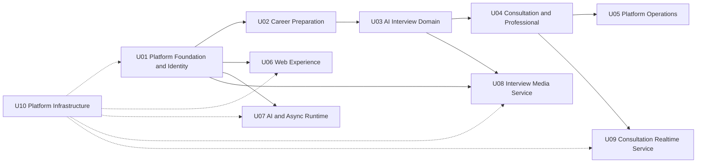

# 작업 단위 의존성 및 실행 순서

## 1. 목적
이 문서는 10개 Unit의 방향성 의존성, 계약 소유, 구현 Wave, Critical Path, 병렬화, 통합·테스트·배포·롤백 조정을 정의한다. Unit 의존성은 Application Design의 컴포넌트 통신을 요약한 계획 관계이며 데이터 소유권이나 Service 경계를 변경하지 않는다.

## 2. 의존성 원칙
1. 행 Unit이 열 Unit의 구현·계약·인프라를 필요로 할 때만 방향성 의존성을 표시한다.
2. U01~U05는 같은 Core API Service 안에 있지만 Module API와 소유 스키마를 통해서만 협력한다. 같은 프로세스는 직접 테이블 접근의 근거가 아니다.
3. 하드 의존성은 선행 Unit의 최소 실행 가능한 계약·행동이 없으면 후행 Unit의 핵심 인수 기준을 완료할 수 없는 경우다.
4. 소프트 의존성은 Mock·Stub·계약 고정으로 병렬 개발할 수 있고 통합 시점에 실제 구현이 필요한 경우다.
5. 계약 전용 의존성은 생성된 타입·Schema와 소유자 계약에 대한 조정이며 구현 import 또는 상대 Unit 내부 모델 참조가 아니다.
6. U07의 Workflow/Queue와 업무 Unit은 `OperationRef`, 단계 Port, 결과 이벤트로 결합해 서로의 데이터 모델을 컴파일하지 않는다.
7. U08과 U09는 서로 의존하지 않는다. 면접 미디어와 상담 실시간 전송의 저장·세션 모델을 공유하지 않는다.
8. U04↔U05처럼 조회·상태 협력이 양방향으로 보이는 경우 한 방향 구현 의존과 반대 방향 소유자 이벤트/버전 계약으로 분리한다.
9. U10은 논리적으로 모든 Unit을 지원하지만 애플리케이션 컴파일 의존성이 아니다. 배포·환경 준비 의존성으로만 표시한다.
10. Audit & Observability 전송은 핵심 성공 경로를 무기한 차단하지 않으며, 감사 필수 작업의 안전 실패 정책은 후속 NFR Design에서 확정한다.

## 3. 표기
- `H`: 하드 구현 선행 의존성.
- `S`: 소프트 구현·통합 의존성; Mock/계약으로 병렬화 가능.
- `C`: 계약 전용 조정; 상대 구현에 대한 컴파일 의존성 없음.
- `I`: U10 공통 인프라에 대한 배포·운영 준비 의존성; 애플리케이션 컴파일 의존성 아님.
- `-`: 직접 의존 없음.

## 4. 10×10 방향성 매트릭스
행은 **의존하는 Unit**, 열은 **선행/제공 Unit**이다.

| From \ To | U01 | U02 | U03 | U04 | U05 | U06 | U07 | U08 | U09 | U10 |
|---|---:|---:|---:|---:|---:|---:|---:|---:|---:|---:|
| U01 | - | - | - | - | - | - | - | - | - | I |
| U02 | H | - | - | - | - | - | C | - | - | I |
| U03 | H | H | - | - | - | - | C | C | - | I |
| U04 | H | H | S | - | C | - | - | - | C | I |
| U05 | H | - | - | H | - | - | C | C | C | I |
| U06 | H | C | C | C | C | - | - | - | C | I |
| U07 | H | C | C | - | - | - | - | C | - | I |
| U08 | H | - | C | - | - | - | C | - | - | I |
| U09 | H | - | - | H | - | C | - | - | - | I |
| U10 | - | - | - | - | - | - | - | - | - | - |

### 4.1 매트릭스 해석 핵심
- U02는 U01 인증·API·공통 계약에 하드 의존하지만 U07은 고정 Port로 대체할 수 있어 계약 의존이다.
- U03은 공고·문서 입력 때문에 U02에 하드 의존한다. U07/U08과는 계약 우선으로 병렬 개발하고 면접 Wave의 통합 게이트에서 결합한다.
- U04는 공고·문서 Snapshot 때문에 U02에 하드, 면접 자료는 선택 범위이므로 U03에 소프트 의존한다.
- U04가 U05의 검증 상태를 소비하는 방향은 `ProfessionalVerified`/검증 Query 계약으로 고정한다. 전체 운영 구현을 기다리지 않는다.
- U05는 실제 상담 운영 View를 완성하기 위해 U04 구현에 하드 의존한다. 따라서 U04→U05의 구현 DAG를 유지하고 역방향 구현 의존은 만들지 않는다.
- U06은 U01의 외부 계약에만 하드 의존하고 업무 화면은 Schema/Mock으로 병렬 구현한다.
- 모든 `I`는 배포 준비 게이트이지 소스 import·패키지·빌드 선행 관계가 아니다.

## 5. 계약 소유자
| 계약/흐름 | 의미·버전 소유 Unit | 주요 소비 Unit | 결합 규칙 |
|---|---|---|---|
| 인증·ActorContext·AuthorizationDecision | U01 | U02~U09 | fail closed, 역할·소유·공유 문맥; 내부 계정 모델 비노출 |
| 외부 REST·SSE·오류·상관관계 공통 형식 | U01 | U02~U09, U06 | 공통 틀은 U01, 리소스 의미는 각 업무 소유 Unit |
| AccountDeletionRequested | U01 | U02~U05, U08 및 데이터 소유 Unit | AccountRef + DeletionGeneration, 멱등 삭제 전파 |
| JobConfirmed·ConfirmedJob Query | U02 | U03, U04 | JobRef + VersionRef, 직접 JOB 테이블 접근 금지 |
| EvidenceReviewCompleted·EvidenceBundle | U02 | U03 및 문서 흐름 | 승인 범위와 VersionRef 고정 |
| 문서 Snapshot·DocumentFinalized | U02 | U03, U04 | 사용자 소유·확정 버전만 제공 |
| 면접 세션·InterviewReportCompleted | U03 | U04, U05 | 리포트 의미·전사 장기 소유는 U03 |
| AI 호출 Port·오류 정규화 | U07 | U02, U03 | 업무 프롬프트·근거·품질은 호출 Unit 소유 |
| Workflow/Queue 실행 계약 | U07 | U01~U03, U08 | 실행 상태만 U07 소유, 업무 Operation 원장은 요청 Unit 소유 |
| MediaRef·구간·만료·삭제 이벤트 | U08 | U03, U05, U07 | 객체·삭제 의미는 U08, 전사·리포트 의미는 U03 |
| Consultation Snapshot·기간 권한·RealtimeGrant | U04 | U06, U09, U05 | 지정 참가자·기간·상태를 모두 검증, 기본 거부 |
| ProfessionalVerified | U05 | U04 | ProfessionalRef + ReviewVersion; U04는 심사 원장을 조회하지 않음 |
| 실시간 Signal/Chat/Reconnect 메시지 | U09 | U06, U04 | 전송 계약 U09, 참가자·기간 권한 U04 |
| 최소 운영 View·재처리 가능성 | 원 상태 소유 U01~U04/U07~U09 | U05 | 민감 본문 제외, 재처리는 원 멱등 범위 보존 |
| 공통 IaC 모듈·환경·관측·백업 인터페이스 | U10 | U01~U09 | 애플리케이션 컴파일 의존이 아닌 배포·운영 계약 |

모든 Schema는 `packages/contracts`에 둘 수 있으나 디렉터리 위치가 의미 소유권을 U01에 이전하지 않는다. 발행자는 하위 호환 버전 정책을 제공하고 소비자는 발행자 내부 모델이나 DB 조회로 계약을 보완하지 않는다.

## 6. 하드·소프트 의존성 및 구현 선후관계
### 6.1 하드 의존성
| 후행 | 선행 | 최소 선행 산출물 | 해제 조건 |
|---|---|---|---|
| U02 | U01 | ActorContext, 인증/소유권 Port, REST/SSE·오류 계약 | 공고→경험→문서 수직 슬라이스 계약 테스트 통과 |
| U03 | U01, U02 | 인증, ConfirmedJob/Document Snapshot 계약 | 면접 대상·동의·세션 생성 통합 테스트 통과 |
| U04 | U01, U02 | 기간 권한 기반, 자료 Snapshot Port | 불변 Snapshot·권한 계약 테스트 통과 |
| U05 | U01, U04 | 운영 역할·감사, 상담 최소 운영 View | 민감 본문 없는 상태 조회·조치 테스트 통과 |
| U06 | U01 | 인증 흐름, 외부 계약·Client 생성 | 로그인·오류·SSE 기반 Shell E2E 통과 |
| U07 | U01 | 상관관계·감사·계약 기반 | 실행 프로세스 health와 공통 envelope 테스트 통과 |
| U08 | U01 | 서비스 인증·감사·계약 기반 | 녹화 Grant와 객체 접근 계약 테스트 통과 |
| U09 | U01, U04 | Socket 승격, RealtimeGrant·권한 Port | 비참가자/기간 밖 연결 거부 테스트 통과 |

### 6.2 소프트·계약 의존성
- U02↔U07: U02가 업무 프롬프트·Operation 원장을 소유하고 U07이 실행한다. Mock AI/Workflow Port로 병렬 개발한다.
- U03↔U07/U08: U03이 면접 의미를, U08이 객체·수명주기를, U07이 실행 상태를 소유한다. 결과 이벤트로 되돌리며 양방향 구현 import를 금지한다.
- U04↔U05: U04는 `ProfessionalVerified` 계약을 소비하고 U05는 이후 U04 최소 운영 View를 소비한다. 구현 DAG는 U04→U05이며 이벤트 Schema는 먼저 고정한다.
- U04↔U09: U04가 RealtimeGrant를 발행하고 U09가 연결 상태 이벤트를 반환한다. U09는 권한을 독자 판정하지 않는다.
- U06↔업무 Unit: 생성 Client/Schema와 Mock으로 화면을 먼저 만들고 각 Wave에서 계약·E2E를 잠근다.
- U10↔전체: 각 Unit이 요구를 제공하고 U10이 공통 모듈을 제공하는 공동 설계 관계다. `I`는 순환 컴파일 의존에 포함하지 않는다.

## 7. 구현 DAG

### 텍스트 대안
1. U01의 최소 인증·계약 기반 뒤 U02, U06, U07, U08을 병렬 시작할 수 있다.
2. 핵심 업무 경로는 U01 → U02 → U03 → U04 → U05다.
3. U08은 기반 이후 독립 구현할 수 있지만 면접 통합은 U03 계약 이후 완료한다.
4. U09는 U04의 RealtimeGrant·기간 권한 계약 뒤 완료한다.
5. U10은 모든 배포 경계를 병렬 지원하는 인프라 게이트이며 애플리케이션 컴파일 선행 노드가 아니다.
6. U04에서 U05로만 구현 의존을 두고 U05의 검증 결과는 선행 고정 이벤트 계약으로 U04에 전달해 순환을 피한다.

DAG의 실선 구현 그래프와 점선 인프라 지원 그래프 모두 위상 정렬이 가능하며 순환 수는 0이다.

## 8. 웨이브 실행 계획
| Wave | 목표 | 주 Unit | 병렬 참여 | Exit 기준 |
|---|---|---|---|---|
| Wave 0 — 최소 플랫폼 기반 | 인증·API·공통 계약·감사·환경 Skeleton | U01, U10 | U06 Shell, U07/U08 실행 Skeleton | 로그인/권한, 계약 생성, health·상관관계, 최소 배포 경계 검증 |
| Wave 1 — 공고·경험·문서 얇은 E2E | 공고 직접 등록→확정→경험 연결→근거 문서 초안 | U02 | U06, U07, U01, U10 | 사용자 입력 보존, AI 실패 수동 경로, SSE 상태, 근거·미확정 불변식 통과 |
| Wave 2 — 면접 | 대상·동의→질문→녹화→후처리→리포트·7일 만료 | U03, U08 | U07, U06, U01, U10 | 재연결·부분 결과·객관 지표·삭제 계약과 통합 테스트 통과 |
| Wave 3 — 상담 | 검증 전문가·예약·불변 Snapshot→영상상담·채팅→결과 | U04, U09 | U06, U01, U02, U03, U10; U05 검증 이벤트 계약 | 기간 권한, Snapshot 불변, 방 격리, 재연결·재예약 E2E 통과 |
| Wave 4 — 운영 확장·전체 경화 | 계정·심사·신고·실패 재처리·감사·복구·배포 검증 | U05 | U01~U10 | 최소 운영 View, 사고 기록, 백업 복원, 장애 격리, 롤백·PBT·전체 E2E 통과 |

Wave는 팀 배정 순서가 아니라 통합 가능한 결과 순서다. U06·U07·U08·U10은 계약이 준비되는 즉시 앞 Wave에서 병렬 개발하며, 각 Wave Exit 전 실제 소유자 구현과 통합한다.

## 9. 핵심 경로와 병렬화
### 9.1 핵심 경로
- **기능 Critical Path**: U01 → U02 → U03 → U04 → U05.
- **상담 실시간 분기**: U01 → U02 → U03 → U04 → U09.
- **릴리스 인프라 게이트**: U10은 위 경로와 병렬이지만 각 Wave 배포·관측·복구 Exit를 차단할 수 있다.
- **면접 미디어 게이트**: U08 구현은 병렬 가능하나 Wave 2 완료는 U03↔U07↔U08 계약 통합에 달려 있다.

### 9.2 병렬화 기회
- U01 계약 초안 후 U06 UI Shell, U07 실행 Skeleton, U08 Service Skeleton, U10 공통 기반을 병렬화한다.
- U02 내부 Job→Experience→Document 의미 순서는 유지하되 리포지토리·UI·계약 테스트는 Module별 병렬화할 수 있다.
- U03의 세션·리포트와 U08의 녹화·삭제, U07의 워크플로 실행을 계약 Mock으로 병렬 개발한다.
- U04 Snapshot/예약과 U09 방·신호 전송, U06 상담 UI를 RealtimeGrant Schema 고정 후 병렬화한다.
- U05의 신고·감사·사고 기록은 심사/상담 운영 View와 병렬 개발할 수 있으나 타 Unit 테이블을 직접 사용하지 않는다.

## 10. 조정 지점
| 시점 | 참여 Unit | 고정·검토 항목 | 승인 증거 |
|---|---|---|---|
| CP-01 기반 계약 Freeze | U01~U10 | ActorContext, Error, Correlation, Idempotency, 계약 버전 정책 | Schema lint·호환성·왕복 테스트 |
| CP-02 Career E2E | U01/U02/U06/U07/U10 | OperationRef, SSE 재개, Job/Evidence/Document 버전 | Wave 1 E2E와 장애 저하 결과 |
| CP-03 Interview Integration | U01/U03/U06/U07/U08/U10 | 동의, MediaRef, Segment, Workflow 결과, 만료/삭제 | 계약·통합·7일 경계 테스트 |
| CP-04 Consultation Integration | U01/U02/U03/U04/U05/U06/U09/U10 | SnapshotRef, ProfessionalVerified, RealtimeGrant, 연결 상태 | 권한·Snapshot·WebSocket E2E |
| CP-05 Operations/Release | 전체 | 최소 운영 View, 감사, 재처리, health, 백업·복원·롤백 | 전체 회귀·복원력·PBT·배포 증거 |

계약 변경은 의미 소유 Unit이 제안하고 소비 Unit이 호환성을 검증한다. 파괴적 변경은 같은 배포 창에 숨기지 않고 확장→소비자 전환→축소 순서의 호환 계획을 요구한다.

## 11. 테스트 체크포인트
| Checkpoint | 필수 검증 |
|---|---|
| TC-00 Unit 설계 | 소유 데이터·권한·상태 머신·오류·복원력·PBT 속성의 추적성 |
| TC-01 계약 | REST/SSE/WebSocket/이벤트/Port Schema lint, 하위 호환, PBT-02 왕복, 잘못된 Actor/Version 거부 |
| TC-02 Module | U01~U05의 교차 테이블 접근 금지, 소유 스키마 마이그레이션, Module 단위 테스트 |
| TC-03 비동기 | at-least-once 중복, 멱등 수렴, 제한 재시도, 체크포인트 재개, 격리·운영 재처리 |
| TC-04 보안·수명 | 인증·최소 권한·감사·민감 로그 금지, Snapshot 기간, 계정 삭제, 미디어 7일 삭제 |
| TC-05 사용자 채널 | 반응형·접근성·입력 보존, SSE 재구독, WebSocket 재연결, 안정적 automation ID |
| TC-06 복원력 | 의존성 장애·단일 AZ·큐 적체·용량 한도·백업 복원·삭제 실패·health 라우팅 |
| TC-07 PBT | PBT-03 불변식, PBT-07 생성기, PBT-08 축소 입력·seed 재현, 선택된 PBT-09 프레임워크 |
| TC-08 전체 Release | 71개 스토리 추적 E2E, 성능 목표, 다중 Service 추적, 이전 버전·IaC 재배포 |

## 12. 배포 및 롤백 조정
### 12.1 배포 단위
- Core API는 U01~U05를 함께 포함하는 하나의 Service 아티팩트다. Module별 코드 완료가 Module별 독립 운영 배포를 의미하지 않는다.
- U07은 같은 코드베이스에서 별도 프로세스 아티팩트·실행 구성을 갖는다.
- U06, U08, U09는 각자의 배포·health·확장·롤백 경계를 갖는다.
- U10은 버전 고정된 공통 및 Service별 IaC 변경을 환경에 적용한다.

### 12.2 호환 배포 순서
1. 하위 호환 `packages/contracts`와 데이터 확장 변경을 먼저 배포한다.
2. U10이 필요한 공통·Service 자원을 비파괴적으로 준비한다.
3. 제공자 Service/프로세스를 구·신 계약 병행 상태로 배포한다.
4. 소비자 Web/Core/프로세스를 전환하고 계약·합성·E2E를 확인한다.
5. 관측 기간과 복원 증거 후 사용 중단 계약·필드를 별도 변경으로 제거한다.

### 12.3 롤백 규칙
- 사용자 결정대로 이전 Git·애플리케이션 아티팩트·IaC 버전 재배포가 기본이며 구체 CI/CD/IaC 도구는 선택하지 않는다.
- DB·이벤트·객체 메타데이터 변경은 이전 애플리케이션이 읽을 수 있는 호환 창을 유지한다. 파괴적 축소는 롤백 가능 기간 이후 수행한다.
- U07 롤백 시 진행 Workflow/Task의 Schema·체크포인트 호환성을 확인하고 중복 실행은 멱등 처리한다.
- U08 롤백이 7일 삭제를 중단하거나 만료를 연장해서는 안 된다. 삭제 대기 목록과 객체 세대를 복구 검증한다.
- U09 롤백 시 기존 방의 안전 종료·재연결/재예약 경로와 RealtimeGrant 호환성을 확인한다.
- 관측·감사·백업 실패가 있으면 기능 배포 성공만으로 Release를 완료하지 않는다.

## 13. 순환·차단 검증 결론
- 실선 구현 의존성은 U01→U02→U03→U04→U05 및 U04→U09 등의 단방향 DAG다.
- U04↔U05, U03↔U08, U04↔U09의 양방향 협력은 이벤트·Query·Port의 의미 소유자를 분리해 컴파일·테이블 순환을 만들지 않는다.
- U10 지원선은 배포 준비 관계로 애플리케이션 DAG와 분리했다.
- **구현 DAG cycle: 0. 컴파일 순환 허용: 0. 차단 발견 사항: 0.**
