# Execution Plan

## Workflow Planning 체크리스트
- [x] 승인된 요구사항, 검증 답변, 페르소나와 사용자 스토리를 로드했다.
- [x] Greenfield 범위, 영향 영역, 복잡도와 위험을 분석했다.
- [x] 조건부 Inception 및 Construction 단계의 실행 여부를 결정했다.
- [x] 활성화된 Resiliency Baseline과 부분 PBT 적용 지점을 매핑했다.
- [x] Mermaid 구문, Markdown 구조, 특수문자와 텍스트 대안을 검증했다.
- [x] 실행 계획과 성공 기준을 작성했다.

## 상세 분석 요약

### 프로젝트 및 변환 범위
- **프로젝트 유형**: Greenfield
- **변환 유형**: 신규 시스템 전체 구축
- **주요 범위**: 계정·권한, 공고·일정, 경험, AI 문서, AI 면접·미디어, 전문가 상담, 전문가·운영자 콘솔, 공통 품질·복원력
- **예상 논리 영역**: 승인된 9개 Epic과 공통 플랫폼 기반
- **Brownfield 관계 분석**: 기존 애플리케이션 코드와 패키지가 없어 해당 없음

### 변경 영향 평가
| 영향 영역 | 판단 | 설명 |
|---|---|---|
| 사용자 경험 | 있음 | 구직 사용자, 전문가, 운영자의 신규 반응형 웹 흐름 전체 |
| 구조 | 있음 | 다중 도메인, 비동기 AI·미디어 처리, WebRTC와 운영 기능 필요 |
| 데이터 모델 | 있음 | 계정, 공고, 경험, 문서 버전, 면접, 상담 스냅샷, 감사 데이터 필요 |
| API·계약 | 있음 | 역할별 UI, 비동기 작업, AI·미디어·이메일·WebRTC 경계 필요 |
| NFR | 있음 | 99.9%, 다중 AZ, Backup and Restore, 관측성, 개인정보와 삭제 정책 필요 |
| 인프라 | 있음 | AWS 서울 리전, 데이터·객체 저장소, 컴퓨트, 큐, 미디어, 모니터링과 IaC 필요 |

### 위험 평가
- **위험 수준**: 높음
- **근거**: 민감 개인정보, AI 사실성, 7일 영상 삭제, 기간 제한 상담 권한, 실시간 미디어와 다중 역할을 함께 구현한다.
- **롤백 복잡도**: 중간~높음 — Greenfield라 기존 서비스 영향은 없지만 데이터·미디어·IaC 버전 호환이 필요하다.
- **테스트 복잡도**: 높음 — 권한, 비동기 상태, AI 근거성, 실시간 연결, 삭제·복원 및 다중 AZ 동작을 검증해야 한다.
- **주요 완화책**: Application Design과 Units Generation으로 경계를 확정하고, 단위별 Functional/NFR/Infrastructure Design과 단계별 품질 게이트를 적용한다.
## Workflow Visualization

```mermaid
flowchart TD
    Start(["User Request"])
    subgraph INCEPTION["INCEPTION PHASE"]
        WD["Workspace Detection<br/><b>COMPLETED</b>"]
        RE["Reverse Engineering<br/><b>SKIPPED</b>"]
        RA["Requirements Analysis<br/><b>COMPLETED</b>"]
        US["User Stories<br/><b>COMPLETED</b>"]
        WP["Workflow Planning<br/><b>COMPLETED</b>"]
        AD["Application Design<br/><b>EXECUTE</b>"]
        UG["Units Generation<br/><b>EXECUTE</b>"]
    end
    subgraph CONSTRUCTION["CONSTRUCTION PHASE"]
        FD["Functional Design<br/><b>EXECUTE PER UNIT</b>"]
        NFRA["NFR Requirements<br/><b>EXECUTE PER UNIT</b>"]
        NFRD["NFR Design<br/><b>EXECUTE PER UNIT</b>"]
        ID["Infrastructure Design<br/><b>EXECUTE PER UNIT</b>"]
        CG["Code Generation<br/><b>EXECUTE PER UNIT</b>"]
        BT["Build and Test<br/><b>EXECUTE</b>"]
    end
    subgraph OPERATIONS["OPERATIONS PHASE"]
        OPS["Operations<br/><b>PLACEHOLDER</b>"]
    end
    End(["Complete"])
    Start --> WD
    WD -.-> RE
    WD --> RA
    RE -.-> RA
    RA --> US
    US --> WP
    WP --> AD
    AD --> UG
    UG --> FD
    FD --> NFRA
    NFRA --> NFRD
    NFRD --> ID
    ID --> CG
    CG --> BT
    BT -.-> OPS
    BT --> End
    style WD fill:#4CAF50,stroke:#1B5E20,stroke-width:3px,color:#fff
    style RE fill:#BDBDBD,stroke:#424242,stroke-width:2px,stroke-dasharray:5 5,color:#000
    style RA fill:#4CAF50,stroke:#1B5E20,stroke-width:3px,color:#fff
    style US fill:#4CAF50,stroke:#1B5E20,stroke-width:3px,color:#fff
    style WP fill:#4CAF50,stroke:#1B5E20,stroke-width:3px,color:#fff
    style AD fill:#FFA726,stroke:#E65100,stroke-width:3px,stroke-dasharray:5 5,color:#000
    style UG fill:#FFA726,stroke:#E65100,stroke-width:3px,stroke-dasharray:5 5,color:#000
    style FD fill:#FFA726,stroke:#E65100,stroke-width:3px,stroke-dasharray:5 5,color:#000
    style NFRA fill:#FFA726,stroke:#E65100,stroke-width:3px,stroke-dasharray:5 5,color:#000
    style NFRD fill:#FFA726,stroke:#E65100,stroke-width:3px,stroke-dasharray:5 5,color:#000
    style ID fill:#FFA726,stroke:#E65100,stroke-width:3px,stroke-dasharray:5 5,color:#000
    style CG fill:#4CAF50,stroke:#1B5E20,stroke-width:3px,color:#fff
    style BT fill:#4CAF50,stroke:#1B5E20,stroke-width:3px,color:#fff
    style OPS fill:#BDBDBD,stroke:#424242,stroke-width:2px,stroke-dasharray:5 5,color:#000
    style Start fill:#CE93D8,stroke:#6A1B9A,stroke-width:3px,color:#000
    style End fill:#CE93D8,stroke:#6A1B9A,stroke-width:3px,color:#000
    style INCEPTION fill:#BBDEFB,stroke:#1565C0,stroke-width:3px,color:#000
    style CONSTRUCTION fill:#C8E6C9,stroke:#2E7D32,stroke-width:3px,color:#000
    style OPERATIONS fill:#FFF59D,stroke:#F57F17,stroke-width:3px,color:#000
    linkStyle default stroke:#333,stroke-width:2px
```

### 텍스트 대안
1. 완료: Workspace Detection → Requirements Analysis → User Stories → Workflow Planning
2. 건너뜀: Reverse Engineering — Greenfield이며 기존 코드가 없음
3. 다음 실행: Application Design → Units Generation
4. 단위별 실행: Functional Design → NFR Requirements → NFR Design → Infrastructure Design → Code Generation
5. 전체 단위 완료 후: Build and Test
6. Operations는 현재 Placeholder이므로 구현 단계에 포함하지 않음

## 단계 실행 계획

### INCEPTION PHASE
- [x] Workspace Detection — Greenfield 판정 완료
- [x] Reverse Engineering — Greenfield이므로 SKIP 완료
- [x] Requirements Analysis — Comprehensive 완료
- [x] User Stories — 3개 페르소나, 9개 Epic, 71개 스토리 완료 및 승인
- [x] Workflow Planning — 본 실행 계획 작성 및 검증 완료
- [x] Application Design — **EXECUTE, Comprehensive**
  - **근거**: 신규 컴포넌트·서비스 경계, 역할별 서비스, AI·미디어·상담 상호작용과 핵심 메서드 정의가 필요하다.
- [x] Units Generation — **EXECUTE, Comprehensive**
  - **근거**: 9개 도메인, 다수 데이터 모델·API, 비동기 처리 및 인프라를 의존성 있는 구현 단위로 분해해야 한다.

### CONSTRUCTION PHASE
- [ ] Functional Design — **EXECUTE PER UNIT, Adaptive Comprehensive**
  - **근거**: 권한·스냅샷·문서 버전·AI 근거·면접 상태·삭제 수명주기 등 복잡한 비즈니스 규칙과 데이터 모델이 있다.
- [ ] NFR Requirements — **EXECUTE PER UNIT, Comprehensive**
  - **근거**: 기술 스택, 성능 부하 모델, PBT 프레임워크, 보안·개인정보, 확장성과 서비스 한도를 확정해야 한다.
- [ ] NFR Design — **EXECUTE PER UNIT, Comprehensive**
  - **근거**: 복원력, 관측성, 장애 격리, 다중 AZ, 재해복구 및 복원력 시험 방식을 설계해야 한다.
- [ ] Infrastructure Design — **EXECUTE PER UNIT, Comprehensive**
  - **근거**: AWS 서울 리전의 컴퓨트·데이터·미디어·네트워크·관측성 자원과 IaC 매핑이 필요하다.
- [ ] Code Generation — **EXECUTE PER UNIT, Comprehensive**
  - **근거**: 각 단위의 계획 승인 후 애플리케이션 코드, 구성, IaC 및 검증 코드를 생성해야 한다.
- [ ] Build and Test — **EXECUTE, Comprehensive**
  - **근거**: 전체 단위 빌드와 단위·통합·계약·E2E·성능·복원력·PBT 실행 지침이 필요하다.

### OPERATIONS PHASE
- [ ] Operations — **PLACEHOLDER**
  - **근거**: 현 AI-DLC 규칙에서 향후 확장 단계이며 배포·운영 구현은 현재 Construction 산출물 범위까지만 다룬다.

## 조정 및 의존성 전략
- **Brownfield 패키지 변경 순서**: 해당 없음.
- **Greenfield 구성 접근**: Application Design에서 컴포넌트 경계를 정한 뒤 Units Generation에서 최종 단위와 의존 순서를 확정한다.
- **예비 의존 방향**: 플랫폼 기반·인증·공통 데이터 → 공고·경험 → AI 문서 → 면접·미디어 → 상담·전문가 → 운영·관측성.
- **병렬화 원칙**: 공통 계약과 권한 모델이 확정된 뒤 독립 도메인은 병렬화할 수 있으나 AI·미디어·상담 통합은 선행 단위의 계약을 고정한 후 진행한다.
- **검증 체크포인트**: 단위별 코드 생성 완료 시 계약·권한·데이터 경계를 검증하고, 모든 단위 완료 후 통합·성능·복원력 검증을 수행한다.
- **롤백 원칙**: 사용자 선택에 따라 이전 Git 태그, 애플리케이션 아티팩트와 IaC 버전을 재배포하며 파괴적 DB 변경은 별도 호환·복구 절차를 설계한다.

## 일정 추정
- **실행할 후속 단계 유형**: 8개 — Application Design, Units Generation, 4개 단위별 설계 단계, Code Generation, Build and Test
- **실제 실행 횟수**: Units Generation에서 정해지는 단위 수에 따라 증가
- **달력 기간**: 단위 분해, 기술 스택과 팀 가용성이 아직 확정되지 않아 현재 단계에서 신뢰 가능한 기간을 제시하지 않는다. Units Generation 이후 산정한다.

## 성공 기준 및 품질 게이트
- 공고 등록에서 근거 기반 문서 초안까지의 핵심 흐름이 추적 가능한 요구사항과 스토리로 구현된다.
- 상담 스냅샷, 기간 제한 권한, 영상 7일 삭제와 AI 근거 경계가 서버 측 규칙으로 검증된다.
- 월 99.9%, 서울 단일 리전 다중 AZ, 수 시간 RTO·RPO와 Backup and Restore 설계가 산출물과 테스트 지침에 반영된다.
- 일반 요청과 장시간 AI·미디어 작업이 분리되고 상태·재시도·실패 격리가 관측 가능하다.
- 부분 PBT 규칙 PBT-02, PBT-03, PBT-07, PBT-08, PBT-09가 해당 설계·코드·CI 단계에서 차단 기준으로 적용된다.
- 모든 단계는 계획 체크박스, 상태 추적, 감사 로그와 명시적 사용자 승인 게이트를 유지한다.

## 확장 기능 준수 요약

### Resiliency Baseline
| 규칙 | Workflow Planning 판정 | 근거 또는 후속 게이트 |
|---|---|---|
| RESILIENCY-01 | 준수 | 중요 워크로드와 장애 영향을 요구사항에 식별했으며 Application Design에서 컴포넌트별로 구체화한다. |
| RESILIENCY-02 | 준수 | 99.9%, 수 시간 RTO·RPO와 Backup and Restore 결정을 후속 설계에 전달한다. |
| RESILIENCY-03 | 준수 | 학생 포트폴리오 예외와 Git 변경 이력 사용 결정을 유지한다. |
| RESILIENCY-04 | 준수 | 직접 배포와 이전 버전 재배포 롤백을 유지하고 CI/CD·IaC 도구 선택을 NFR/Infrastructure Design에 배치한다. |
| RESILIENCY-05 | 준수 | Metrics·Logs·Traces·Dashboard 설계를 NFR 및 Infrastructure Design 필수 범위로 배치한다. |
| RESILIENCY-06 | N/A | 아직 런타임 컴포넌트가 없어 헬스 체크는 Application/NFR Design에서 정의한다. |
| RESILIENCY-07 | N/A | 구체 자원과 확장 정책이 없어 복원력 알람·용량 감시는 Infrastructure Design에서 정의한다. |
| RESILIENCY-08 | 준수 | 사용자가 서울 단일 리전 다중 AZ를 선택했으며 인프라 설계 게이트로 전달한다. |
| RESILIENCY-09 | N/A | 런타임과 부하 모델 확정 후 NFR/Infrastructure Design에서 적용한다. |
| RESILIENCY-10 | 준수 | 타임아웃·제한 재시도·격리·단계적 저하를 Functional/NFR Design 범위에 포함한다. |
| RESILIENCY-11 | 준수 | 수 시간 목표의 Backup and Restore 전략을 후속 단계에 전달한다. |
| RESILIENCY-12 | 준수 | 자동 백업·암호화·보존·복원 검증을 Infrastructure Design과 Build and Test에 배치한다. |
| RESILIENCY-13 | N/A | 구체 복구 Runbook은 인프라 구성 확정 후 작성한다. |
| RESILIENCY-14 | N/A | 사용자 결정이 필요한 복원력 시험 방식은 NFR Design에서 질문·확정한다. |
| RESILIENCY-15 | 준수 | 경량 장애 대응·사후 회고 절차 결정을 관측성·알림 설계에 전달한다. |

**Resiliency 차단 발견 사항**: 없음.

### Property-Based Testing
- **적용 모드**: Partial — PBT-02, PBT-03, PBT-07, PBT-08, PBT-09만 차단 규칙이다.
- **Workflow Planning 직접 적용**: 해당 없음. 이 단계에는 테스트 구현이나 프레임워크 선택 산출물이 없다.
- **후속 적용 계획**: Functional Design에서 왕복·불변식 후보를 식별하고, NFR Requirements에서 PBT-09 프레임워크를 선택하며, Code Generation과 Build and Test에서 PBT-02·03·07·08을 구현·실행한다.
- **PBT 차단 발견 사항**: 없음.

### Security Baseline
- **상태**: 비활성화 — 사용자 결정에 따라 확장 규칙을 적용하지 않았다.
- **프로젝트 고유 보안**: 인증, 최소 권한, 암호화, 감사, 민감 로그 금지와 삭제 요구사항은 후속 단계의 필수 품질 조건으로 유지한다.
